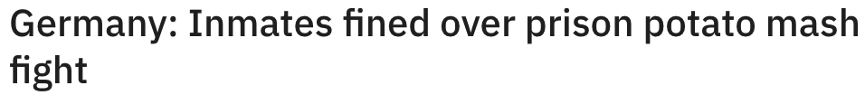
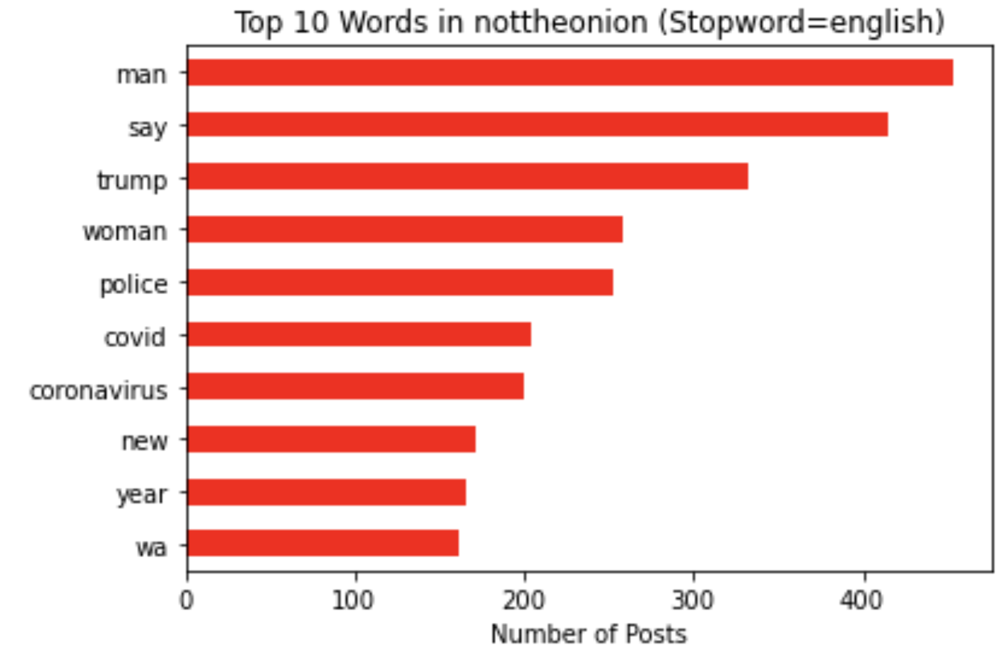

# Project 3 - TheOnion vs NotTheOnion

## Table of Contents
1. Problem Statement
2. Data Gathering, Cleaning and EDA
3. Preprocessing and Modelling
4. Chosen Model Evalutation
5. Conclusions and Reccomendations

## Introduction

In this globalised age, information is easily spread via numerous channels. One medium that has gained popularity as a news source in the past decade is social media, through platforms such as Facebook, Twitter and Instagram.

### Fake News

Unfortunately, such ease of access to news via social media has given rise to the prevelance of fake news. Fake news is simply false or misleading information presented as news. 
Fake news is often used for malicious purposes, such as creating political agendas, causing panic, and in recent years, generating anti-vaccine sentiment.

## 1. Problem Statement

Fake news is a prevalent and harmful problem in our modern society, often misleading the general public on important topics such as healthcare and defense. This can lead to long standing societal issues which are a detriment to nations worldwide. 

In view of this menace, our team aims to develop a classification model that is discerning enough to separate fake news from real news, based on the headline alone. This model must be simple to use, and also minimize false positives and false negatives, so that the users of this model, which include government bodies such as the police, and even regular citizens, can weed out the fake news easily, thus creating a secure, and more misinformation-resilient society.

But first, in order to build a model, we will first need data.

### The Onion

 

The Onion is an American digital media company and newspaper organization that publishes satirical articles on vairous news topics. These articles are often references real world figures or events, but places the subjects in completely imaginary, and often ridiculous or hilarious scenarios.

 

Since The Onion often references real world figures or events in fake news articles, TheOnion subreddit https://www.reddit.com/r/TheOnion/ will serve as the source of our fake news dataset.

We will now have to find a source of real news that is the opposite of The Onion.

### Not The Onion

 

As it's name suggests, the subreddit called **nottheonion** is not The Onion. However, it contains *'true stories that are so mind-blowingly ridiculous that you could have sworn they were from The Onion'*.

 

Since nottheonion subreddit https://www.reddit.com/r/nottheonion/ is real news of hilarious or ridiculous nature, it is the perfect subreddit of which we will extract our real news dataset.

## 2. Data Gathering, Cleaning , EDA & Data Dictionary
### 2.1 Scraping from the subreddits
For this action, we used Reddit's Pushshift API

Considerations:
- Latest date 1st January 2022, 0:00 hrs, (GMT+8)
- Pull at least 5,000 posts from each dataset
- Delete duplicates as we pull in blocks of 100 posts
- Combine the dataframes as we pull

We finally ended up with 2 datasets of over 5,000 posts each, from r/TheOnion and r/nottheonion.

### 2.2 Data Cleaning
#### Getting the relevant columns
There are many columns in the datasets (83 in total). However, most are irrelevant for the modelling. 
Only columns relevant to the modelling will be chosen. These are:
- `subreddit`: this is the subreddit the post is from
- `title`: this is the title ie **'The Headline'** of the post. The headline is the text that decides whether people will read the news article or not, and if our model can weed out potential fake news just by the headlines, it will be a significant victory because people will not be duped into reading the fake news article in the first place!
- `created_utc`: this is the time at which the post was uploaded. Keeping this for ease of sorting.

We then combined the 2 datasets together to get a single dataset.

#### Tokenizing and Lemmatizing the Title Text
The next step is to tokenize and lemmatize the title text. Tokenization breaks the raw text into words called tokens. Lemmatization converts the tokens into root form of word, while reducing number of variables and preserving the meaning of the text.

After tokenization and lemmatization, the individual tokens are joined back together to form some semblence of a sentence, called the `new_text`.

#### Removal of Outliers
Outliers for this dataset are `title`(s) that have:
1. A single emoji as a title
2. A single word as a title
3. A single url as a title
4. 2 words as a title, as those have very little to no meaning
5. Non-english characters as the entirety of the title text
6. Duplicates
7. Posts that contain the word 'onion'

All these serve to add 'noise' to the dataset, and for item 7, biasness, since for example, TheOnion may reference itself in a headline.

These outliers were removed from the dataset.

#### Balancing the datatset
After the dataset has been cleaned, we were left with a slighly imbalanced dataset:
- nottheonion: 5170 posts (50.5%)
- TheOnion: 5073 posts (49.5%)

We then proceeded to reduce the number of posts from each subreddit to 5000 each and ended up with a balanced dataset:
- nottheonion: 5000 posts (50%)
- TheOnion: 5000 posts (50%)

### 2.3 EDA on the dataset
#### Top Words in TheOnion
With English stop words removed:
 

#### Top Words in nottheonion
With English stop words removed:
 

Common words for both TheOnion and nottheonion are **'new', 'man', 'woman', 'trump'**, **year** and **'say'**.

#### Top Title Lengths in the `new_text`
For this, we created a new column called `newtext_length`, which is the count of the number of characters in the `new_text`.
 
For TheOnion, the `newtext_length` peaks between the 60 - 90 range, with median of 77. 
For notheonion, the `newtext_length` peaks sharply between the 60 - 75 range, with median of 71. 

#### Top Word Counts in the `new_text`
For this, we created a new column called `newtext_word_count`, which is the count of the number of words in the `new_text`.
 
For TheOnion, the `newtext_word_count` peaks between the 10 - 15 range, with median of 13. 
For nottheonion, the `newtext_word_count` peaks sharply between the 9 - 14 range, with median of 12.

### 2.4 Data Dictionary
|Feature|Type|Description|
|---|---|---|
|**subreddit**|object|Subreddit of TheOnion or nottheonion|
|**title**|object|Headline of the post|
|**created_utc**|int64|Epoch at which post was created|
|**title_length**|int64|Character count of the title|
|**title_word_count**|int64|Word count of the title|
|**new_text**|object|Title after tokenization and lemmatization|
|**newtext_length**|int64|Character count of the new_text|
|**newtext_word_count**|int64|Word count of the new_text|

## 3. Preprocessing and Modelling
### 3.1 Generating Binary Classifier Column

Since we want to create a model that will effectively predict which news is fake, we will use TheOnion as positive, since it is satire and not real news.

**1: TheOnion 
0: nottheonion** 
Create one new column called `onion` for this binary data.
### 3.2 The X and y features
**X**: `new_text` column of the dataset 
**y**: The binary column `onion`
### 3.3 The models
- Baseline - K-Nearest Neighbours with no hyperparameter tuning
- K-Nearest Neighbours with hyperparamter tuning
- Random Forest with hyperparamter tuning
- Multinomial Naive Bayes with hyperparamter tuning
- Logistic Regression with hyperparamter tuning
- Support Vector Machine with hyperparamter tuning

The chosen vectorizer is **CountVectorizer**.

The metrics we will use to evaluate the model are:

- Accuracy
- Recall
- Precision
- **f1 Score** - the most important, and we will select the model based on which has the highest f1 score, since minimizing false positives and false negatives are equally important.

### 3.4 Summary of model performance based on holdout test set scores
|Model|Accuracy|Recall|Precision|f1 Score|
|---|---|---|---|---|
|Baseline|0.58|0.5688|0.581833|0.575243|
|k-Nearest Neighbors|0.6048|0.6952|0.588753|0.637564|
|Random Forest|0.7496|0.7128|0.76943|0.740033|
|Multinomial Naive Bayes|0.7908|0.8184|0.775588|0.796419|
|Logistic Regression|0.7852|0.78|0.788197|0.784077|
|Support Vector Machine|0.7804|0.7784|0.781526|0.77996|

The Baseline model being k-Nearest Neighbors without any hyperparameter tuning.

The baseline(KNN with no hyperparameter tuning) has the worst overall performance, with every other model outperforming it in all chosen metrics.

Multinomial Naive Bayes has the best accuracy, recall, precision and f1 score, f1 score being the most important metric in this project.

As Multinomial Naive Bayes has the highest number of best metrics, especially the f1 score, it will thus serve as our recommended model.

## 4. Chosen Model Evaluation on Test Data
### 4.1 ROC Curve for Chosen Multinomial Naive Bayes Model
 
The ROC plot for the reccomended MNB model shows a fairly smooth curve with an AUC of **0.88** the model is a 88% chance that the model can distinguish between a post from TheOnion and nottheonion.

The optimal classification threshold is around 0.8, where we can maximise the true positives while keeping false positive rate at a manageable level.

### 4.2 Intepretating the coefficients using Logistic Regression
Multinomial Naive Bayes Model is a blackbox model. Thus if we want intepretability, we will use logistic regression and study the top and bottom coefficients.

 
#### Strong predictors of TheOnion (Fake News)
- Profanities such as 'shit' and 'fucking' are indicators that the news is fake
- The word 'announces' and 'congress' very likely go hand in hand in many fake news articles
- The word 'nation' also is a strong predictor. Anything that affects the 'nation' is bound to draw attention, and thus fake news creators may use this word often.
- An interesting one is the bigram 'said what'. These two words when used together with someone famous, conjures up feelings of controversy. Such headlines are also a signature of tabloids, and thus will be rare in a real news headline.

#### Weak predictors of TheOnion (Fake News)
- The word 'Police' is a weak indicator, possibly because there are numerous real news articles involving the police on a daily basis, on a variety of cases.
- The word 'uk' is a confusing one. It is likely to be the United Kingdom. Perhaps they are the most trustworthy country on earth? I am unable to draw any conclusions from this one.
- The words 'toilet and 'Florida' are noteworthy. There are many sensational incidents that happen in these 2 very different locations.
- The words 'snake' and 'chicken' are that of animals. If an animal ends up in the news, the scenario is probably sensational already, thus not as much value can be placed on a fake news article involving animals.
- The word 'accused' and the law have many things in common. In daily news, there are many articles of various individuals being 'accused' of 'multitude' of offenses.

## 5. Conclusions and Recommendations
By choosing the Multinomial Naive Bayes(MNB) model as the recommended model, we are able to achieve good metrics, with a f1 score of **0.796419**, showing that this MNB model did in fact minimize the false positives and false negatives. 
This was further backed up by the ROC curve of the MNB model showing a an AUC of **0.88**, which is close to the maximum possible AUC of **1**. This model thus fulfils the 'minimize false positives and false negatives' criteria. 
Since the model is MNB, it is not very intepretable and thus is perfect for the general public, who just want to key in the news headline and get an answer whether it is likely to be fake news or not. It will also be easy to develop this model into an app, as the number of features required will be lesser. 
However, should one require a model with greater intepretability, then Logistic Regression should be chosen.

More advanced techniques, such as using TENSORFLOW and BERT, could be used in the future to generate models with strong metrics. 

Another limitation of the chosen MNB model is that it can only predict English headlines. Further study and development of the model to accept other languages can be explored.

Lastly, the datasets were pulled from sometime between end 2018 to end 2021, a 3 year time span. The hot topics may change over the course of 2022 and beyond, so this model needs to be constantly re-trained on the most updated news topics for it to stay relevant.
